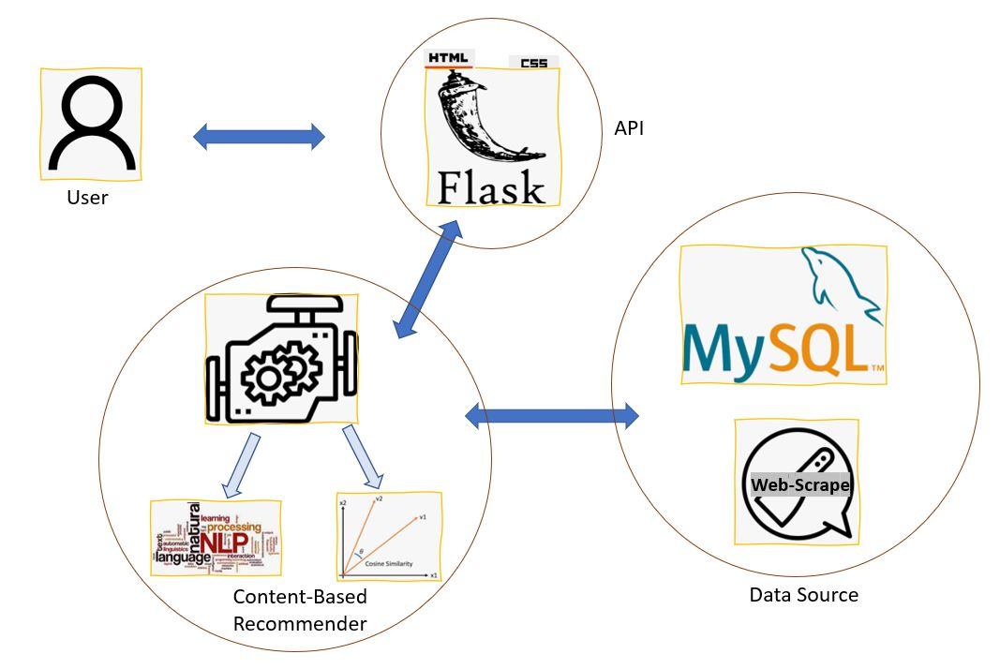

# Movie-Recommendation-App
A content based movie recommendation app

## Movie Recommendation App that uses text analysis, metadata similarity calculations and effective attribute selection and combination to provide relevant and insightful movie recommendations.

## Demo:

As seen in the above demo, this app takes an example movie from the user as input and displays the 10 similar movies of comparable or better quality(per user ratings)
In this video, the example movie of the 2007 hit comedy film Superbad starring Jonah Hill and Michael Cera, directed by Greg Mottala, results in recommendations including This is the End(2013), Pineapple Express(2013), Ferris Bueller's Day Off(1989), Easy A(2010) and 17 again(2009), among others, which are relevant movies with cast, theme, genre and quality.

## Workflow:
* Movie Data Source: The original dataset was sourced from Kaggle, and was subsequently modified, cleaned, enhanced with additional attributes and loaded into my MySQLdb local server
* Recommendation Engine: The recommendation engine is built on python, utilizing NLP and cosine similarity to identify the best recommendations for each movie
* Web App: The app is built using Flask, and HTML and CSS has been used for the front-end components

## FlowChart:

## Methodology:
### Data Prep:
#### Data Clean-Up: 
The dataset sourced from Kaggle has 45000~ movies, including movies of multiple languages and of varying length (short films included). For the purposes of this exercise I reduced the dataset to only those movies atleast 100 vote counts each, which brought the dataset down to 6000~ movies. After several permutations and combinations, the categories that were subsequently identified as crucial for recommending movies:
* Directors
* Writers
* Actors
* Genres
* Keywords
* ~~Plot Overview~~

While the initial model involved identifying the above metadata attributes and assigning a fixed weightage to each category toward the final similarity score, I found this method to be unweildy with inadequate recommendation quality. This method had several issues, few of which include:
Existing keywords in dataset are generally poor and not representative of the main/acclaimed aspects of a movie.
Plot Overview while helpful, does not truly encapsulate what makes a movie similar to another, which resulted in movies of wildly different genre/vibe being scored as similar to each other due to a similarity in their plots at a basal level.
Fixed weightage of categories fails to take into account the fact that different categories of a movie can be the reason for its popularity.

In an ideal scenario we would not only take into consideration content-based similarity but individual user preferences, but due to the nature of the dataset and limitations of the exercise we do not have historical ratings or preferences for someone who uses the app. As a result, I decided the next best way to determine the best aspects of a movie would be to analyze the content of the reviews of the movie, which was not present in the dataset. This is where I leveraged the IMDb reviews of the movies.

#### Data Enhancement: 
As IMDb is the single best source of movie information, I used web-scraping to source 500~ reviews per movie for the purely educational purpose of exploring a good recommendation system. The reviews for each movie were then cleaned and text and sentiment analysis(detailed below) was performed before enriching with existing dataset.  

### Engine:
The app uses the following methodology to make meaningful recommendations to the user:
1) User enters movie name, which we will call the example movie for the rest of this article.
2) NLP: Reviews of the example movie are sourced and are involved in two aspects of the recommendation:
    - Category Weightage: The cleaning steps include stopword removal, tokenization and lemmatization, and further, only the nouns are retained (using wordnet synset part of speech). The resultant bag of words are used to identify the top 50 most used words across all the reviews for the example movie. Each of this 50 words are checked for presence in the following buckets and their counts are totaled towards each category:
        + 'director', 'direction', 'visuals', 'cinematography', 'style' contribute to the directors category
        + 'script', 'screenplay', 'writing', 'dialogue', 'story' contribute to writers category
        + 'actors', 'cast', 'performance', 'role' contribute to the actors category
        + The words that do not fall into any of the above buckets are considered keywords and added to the original keyword set of the example movie(from the Kaggle dataset). Given keywords have a fixed weightage of 0.4 the remaining categories of directors, writers, actors and genres are ordained a weightage on the basis of the fraction of counts they each totaled to as mentioned above. The weightage of all categories sums up to 1.
    - (Within-category) Element Weightage: While the above has determined the weightage of the overall category, we want to perform additional text analyses to understand people's sentiments towards particular elements within these categories. For example, while a cast may have 10 actors, which could lead to a high weightage of the actor category, only 2 of the 10 actors might be most lauded or singled out by the user reviews, so in this part we analyze the reviews by first identifying the entities (to isolate names of actors/directors/writers/keywords) using spacy entity classifier and then using nltk concordance search to arrive at positive sentiment score for each director/writer/actor of the movie. The smallest non-zero element's score is treated as the baseline and the other non-zero elements are assigned repetition counts as a ratio of that baseline value. These repetition counts inform us of the number of times the given element, say actor 'Leonardo DiCaprio' for the example movie Shutter Island needs to be repeated in the soup (that we will create for the final similarity score calculation) so that other movies that also have Leonardo DiCaprio receive higher similarity scores
3) Similarity: So now armed with the weightage of each category (Director/Writer/Actor/Genre/Keywords) and the number of repetitions within each category (for eg within Actors category: LeonardoDiCaprio LeonardoDiCaprio LeonardoDiCaprio MarkRuffalo MichelleWilliams), we calculate the cosine similarity of each category of the example movie with the other movies. 

### Recommendation
Finally we perform one more calculation to take into the account the populous opinion so that the quality of the recomendations are the same or better than the example movie: 
The reasoning here is if the user enters an example movie which has a high user rating, then we ideally do not want to recommend a movie with very low ratings despite any high similarity. So the following calculation ensures that the recommended movies meet the lower bound threshold calculated from the rating of the example movie-

$$threshold = score-((1-(10-score)/10)*(3))$$

 * The above score results in a threshold of 7 for an example movie with a user rating of a perfect 10 (meaning only similar movies with a rating>= 7 will be recommended in this case)
 * On the other hand a movie for which the example movie rating is 3, the formula will determine the threshold as 2.1, so will recommend only those similar movies which have a rating of atleast 2.1

In this manner we are preventing the recommendation of a movie that might be similar in keywords and crew but is of much poorer quality than the example movie entered by the user.

We then print out the top 10 such movies that are similar to the example movie.

